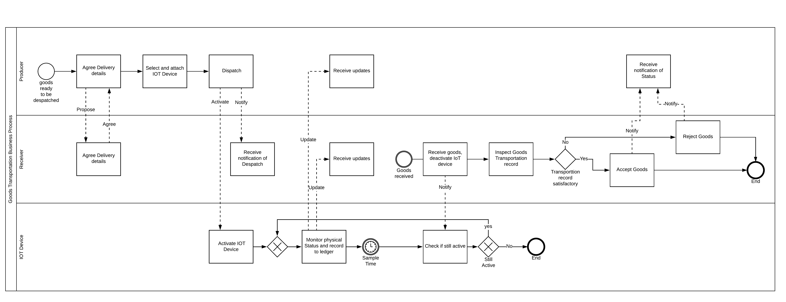

# Requirements
## Use case

The Cordapp will be used to facilitate the transportation of Goods from a 'Producer' to a 'Receiver'. During Transit there are physical conditions that must be met which will be measured and recorded by a specialist IOT Device.

### Actors

Producer 

 - Example Producer: Small farmers dispatching gourmet sausages from their farm
 - There will be many small Producers on the network
 - The Producers are not positioned to run full Corda nodes
 - The Producers will have access to the Internet
 - The Producer should only have visibility of their own Transported goods
 
 Receiver
 
 - Example Receiver: Supermarket with several Warehouses
 - The Receivers are large enough to run their own nodes.
 - The Receivers have multiple locations which will receive goods, the system needs to deliniate between different locations
 - The Receivers should be able to set criteria that the Goods delivery must adhere to, eg maximum temperature
 - The Receivers should be able to Accept or Reject Goods based on the Data provided by the IoT device
 - The Receiver warehouse operator should be able to see either: 
   - Only deliveries to the specific warehouse, or
   - Deliveries to all warehouses owned by the SuperMarket, depending on access rights. 
 
 IoT Device
 
 - Example IoT device: Temperature Tracker, eg the Goods must be temperature checked every 30 minutes and must not be above 4 degrees centigrade
 - There will be many IoT devices managed by a separate company to the Receiver and Producer. 
 - The IoT device should evidence its physical reading and the time the reading was taken on the ledger
 - The IoT device should evidence which transportation agreement the physical readings have been recorded for
 - The IoT device should only take Readings whilst the transportation is in progress
 - The IoT device should not be able to receive data which does not relate to its current transportation
 

## Actions

The Producer should be able to take the following actions:

 - Agree Transport details with the Receiver
 - Select an IoT monitoring device
 - Dispatch the goods, including activation of the IoT device
 - Monitor status of the goods in transport 

The Receiver should be able to take the following actions: 

 - Agree Transport details with the Producer
 - Monitor status of the goods in transport 
 - Accept the goods, based on satisfactory IoT measurements
 - Reject the goods, based on unsatisfactory IoT measurements

The IoT Device should be able to take the following actions: 

 - Periodic measurement of physical status of the Goods
 - Recording of the physical measurements and time of measurement on the Ledger 
 - Stop periodic measurements

The Good Transportation Business Process should be as follows:

